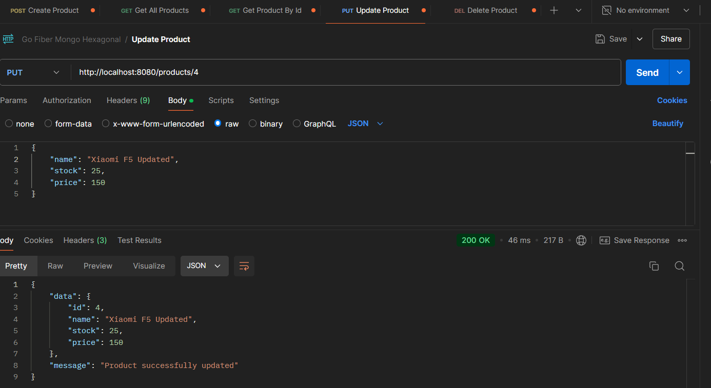
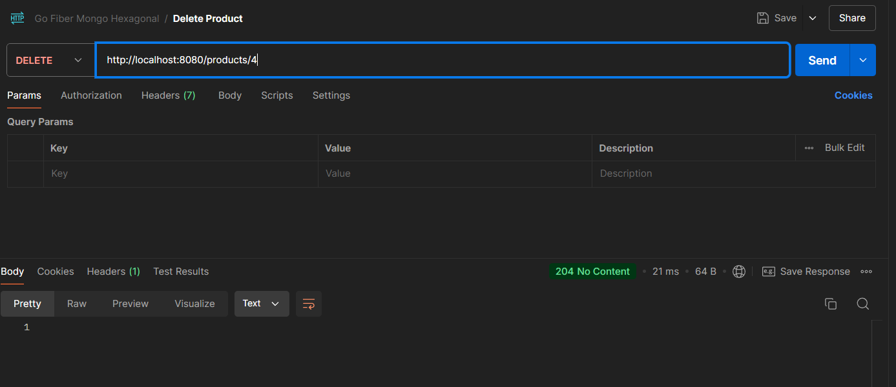

# Hexagonal Architecture Using GO
🚀 Find a more detailed explanation about the concept and code in my [LinkedIn Article](https://www.linkedin.com/pulse/hexagonal-architecture-action-building-rest-api-go-rizki-hamdalah-f25ic/?trackingId=Lq%2F%2FSnKYSDWWIS%2FFaW2MEg%3D%3D).\
⭐ Give a star if you think this repository is awesome

## Table of Contents
- [About](#-about)
- [Getting Started](#-getting-started)
- [Result](#-result)

## 🤔 About
This repository shows how to implement hexagonal architecture using Go. Hexagonal Architecture, or Ports & Adapters Architecture, is a cool way to build software systems that stay flexible and easy to update. 

\
\
To demonstrate, I created a simple REST API for product management. What implemented in this repository:
- Build REST API for product management using Go, Fiber, and MySQL.
- Organize our project to implement hexagonal architecture.
- Implement request profiling to the requests our server receives, storing them in the database.
- Create unit testing for repository, service, and handler.

To run the project, you should fulfilled this requirements:
- Go (I'm using version go1.21.3)
- MySQL database (For storing our product)
- MongoDB database (For storing our request profiling)
- IDE/text editor (I'm using VsCode)
- Postman for testing the API

## 🏁 Getting Started

### Setup MySQL Database
First, you need to setup the MySQL database, create a database named "golangdb" with bellow command.
```
CREATE DATABASE golangdb;
```
Next, create a product table with this command.
```
CREATE TABLE golangdb.products (
    id INT AUTO_INCREMENT PRIMARY KEY,
    name VARCHAR(255) NOT NULL,
    stock INT NOT NULL CHECK (stock >= 0),
    price INT NOT NULL CHECK (price > 0)
);
```

### Setup MongoDB Database
To set up MongoDB to store our profiling requests. Create a new database called “product-management”, then create a collection called “request-logs”. You can easily create this using the MongoDB Compass GUI.

The end result will look like this.


## Running the Go Application
To run the program by typing this command in the terminal, your position at the root of the project.
```
go run ./cmd/http/main.go
```
The application will run as below


## Running the Unit Test
To run test you can run this command in your terminal, your position is in the root of the project.
```
go test -v ./...
```

That's will run all your unit test, the result should be like below.


## 😎 Result

### API Result
- Create New Product

- Get All Product

- Get Product By Id

- Update Product

- Delete Product


### Request Profiling
- Logging Preview

- Persisted in MongoDB
